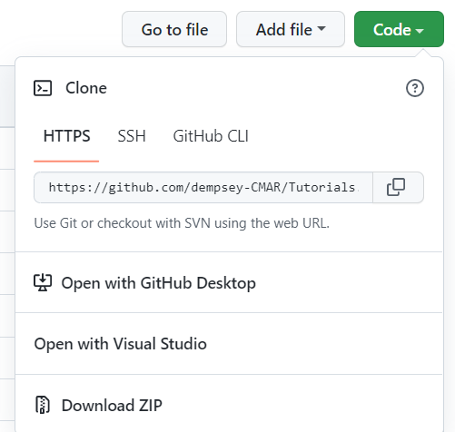
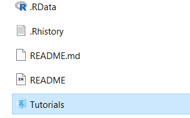

<!-- README.md is generated from README.Rmd. Please edit that file -->

```{r, include = FALSE}
knitr::opts_chunk$set(
  collapse = TRUE,
  comment = "#>"
)
```

# Tutorials

These tutorials are a useful introduction to the R programming language and many of its packages; by doing them, one can learn about R basics, importing data, plotting, the dplyr package, mapping, iteration, functions, dashboards, and more. The tutorials were originally developed to help employees of the Centre for Marine Applied Research (CMAR) with varying levels of R coding experience learn more R techniques. 

To do the tutorials, download this repository to your own computer by clicking the green "Code" button and choosing "Download ZIP" (Figure 1).

```{r fig1, echo = FALSE, out.width="50%"}



```
<br>
Figure 1: Download the ZIP file.
<br>
<br>
Once you have extracted all the files to the location of your choice on your computer, click the "Tutorials.Rproj" file to open the project (Figure 2). Each tutorial folder contains all the code files and data needed to do that tutorial. To make sure the file paths in the tutorials are correct, always do the tutorials with the project open, and do not remove the tutorial folders from your local repository.

```{r, echo = FALSE, out.width="50%"}



```
<br>
Figure 2: Open the R project file.
<br>
<br>
If you have any questions or concerns about the code, you may create a new issue on GitHub.

